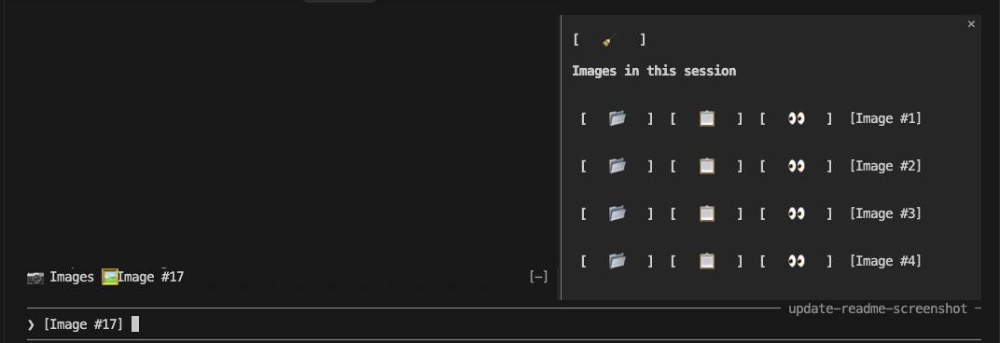

# image-preview

A Claude Code mod for previewing images you paste or drop into the prompt.

## Why

You paste or drop an image into the prompt, don't submit, and step away. When you come back, the prompt only shows `[Image #1]`, and you can't tell which image that was. Claude Code has no way to preview it from the prompt. This was raised in [anthropics/claude-code#68986](https://github.com/anthropics/claude-code/issues/68986), which was closed.

This mod fills the gap: the `🖼 Image #N` chips above the prompt open the pending image in your OS viewer. It works for images pasted from the clipboard as well as dropped files, before you submit. Type a space after the `[Image #N]` tag that Claude Code inserts, so the chip appears.



## What it does

- **Band above the prompt:** a `📷 Images` button, plus a `🖼 Image #N` chip for each `[Image #N]` in your draft. Clicking a chip opens that image in the OS viewer (Preview on macOS).
- **Images pane:** `📷 Images` shows or hides it. It is hidden by default. Each row has:
  - `📂` reveal the file in Finder
  - `📋` copy the file path to the clipboard
  - `👀` open the image in Preview
  - `[Image #N]` label, which also opens the image; hover the buttons for a tooltip
  - `🧹` at the top clears the list
- **Slash command:** `/image-preview` opens the pane. `/image-preview 2` opens image 2 in Preview.

## How it works

The mod watches your draft for `[Image #N]` tags. For a dropped file it remembers the original path. Otherwise it finds the copy Claude Code saved at `<session>/images/N.png`, by searching the temp folders with `find`. The chips use whichever is available, and show a notice if neither is.

The Images pane lists the images found on disk. It rescans on every prompt submit, and whenever you open the pane or run `/image-preview`. 🧹 Clear hides the current images for the rest of the session. Clicking an image's chip brings it back.

## Install

Try it from a checkout:

```
claude --plugin-dir /path/to/image-preview
```

Or install it from GitHub, inside Claude Code:

```
/plugin marketplace add sandipchitale/claude-code-image-preview
/plugin install image-preview@image-preview
```

Then run `/reload-plugins` (or restart). Choose **user** scope to use it in every project.

## Limits

- Built and tested on Claude Code v2.1.292 on macOS, with Sonnet 5.5.
- The chip appears only after you type a space after the `[Image #N]` tag.
- Open and reveal try the first command that works on your system:

  | OS | Open | Reveal |
  |---|---|---|
  | macOS | `open` | `open -R` (selects the file) |
  | Linux | `xdg-open` | `xdg-open` on the folder (the file is not selected) |
  | Windows | `cmd /c start` | `explorer /select,` |

- **Linux and Windows have not been tested.** The commands above are untested there. Only macOS has been tried. Finding the saved images uses `find` over `/private/tmp` and `/tmp`, so Windows would also need a Unix-style `find` (for example from Git Bash) on its `PATH` for the pane to list images.
- The mod API has no hook for clicks on the native `[Image #N]` widget, so the chips above the prompt stand in for it.
- The tooltip positions in the pane assume fixed button widths. A terminal that draws emoji at a different width may misplace them.
- The terminal inverts a `Button`'s colors on hover or focus, and the mod can't turn that off.
- A button in a pane that doesn't hold focus may need a second click.

## License

MIT
